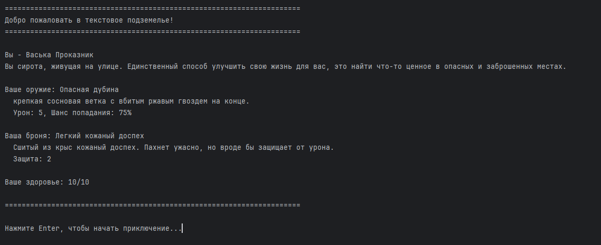
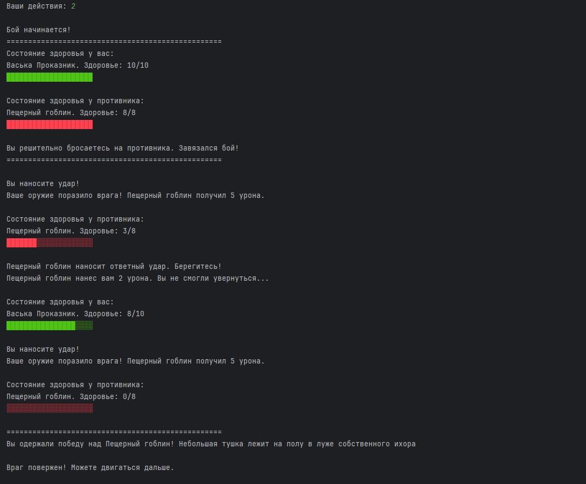
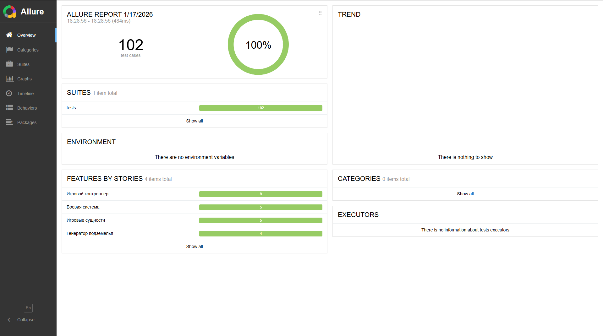
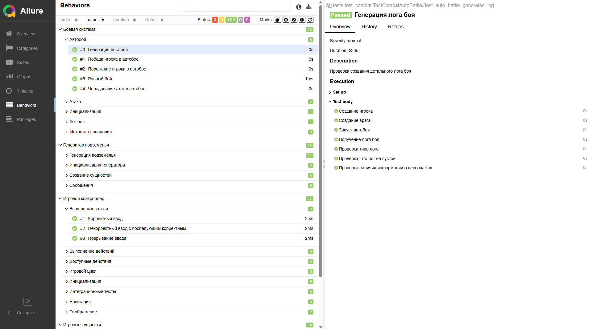

[](https://www.python.org/downloads/release/python-3100/)
[](https://docs.pytest.org/)
[](https://allurereport.org/)

# Text Console RPG 

Простая текстовая консольная RPG на **Python 3.10**. Тестовое задание в Lesta Games.

## Условие

Нужно было реализовать текстовую RPG по дизайн-документу:

- Есть **карта-подземелье** — одномерный список комнат (`St` стартовая, `Rm` обычная, `Ex` выход).
- Комната может быть **пустой** или содержать **противника**.
- При входе в комнату выводится **случайное описание комнаты** (из JSON), а при наличии врага — **случайное описание врага** (из JSON).
- Игрок выбирает действие **числом через `input()`**.
- Доступные действия зависят от условий:
  - **Пойти дальше** — если не `Ex` и в комнате нет живого/непобежденного врага
  - **Вернуться назад** — если не `St`
  - **Атаковать** — если в комнате есть живой/непобежденный враг
  - **Выйти из подземелья** — если комната `Ex`
- После действия выводится результат; если игрок остался в комнате — доступно движение.
- Если игрок проигрывает бой — игра завершается.

Требования:
- Все текстовые данные хранятся в **JSON** (`data/*.json`).
- Для задач 1–3 использовать только **стандартную библиотеку Python**.
- Автотесты — на **pytest**, лежат в директории `tests`.
- Автобой: атаки чередуются до смерти одной стороны; шанс попадания через `randint`, урон по формуле `max(0, damage - defense)`.

## Структура проекта

- `data/` — JSON с игроком, врагами, комнатами, сообщениями
- `src/`
  - `entities.py` — сущности (Player/Enemy/Room/Weapon/Armor)
  - `dungeon.py` — генератор подземелья + сообщения
  - `controller.py` — игровой цикл и ввод пользователя
  - `combat.py` — автобой + лог боя
- `tests/` — автотесты (pytest) + фикстуры

## Запуск игры

```bash
python -m src.main
```

## Тесты и Allure-отчет

Установка зависимостей (пример):
```bash
pip install -r requirements.txt
```

Запуск тестов:
```bash
pytest -q
```

Запуск тестов с Allure результатами:
```bash
pytest --alluredir=allure-results
```

Генерация и просмотр отчёта:
```bash
allure serve allure-results
```

## Демонстрация работы проекта

1) **Начало игры в консоли**  


2) **Реализация автобоя**  


3) **102 автоматизированных тестов (отчет Allure)**  


4) **Раскрытие steps в Allure**  

